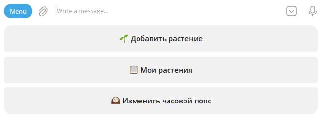
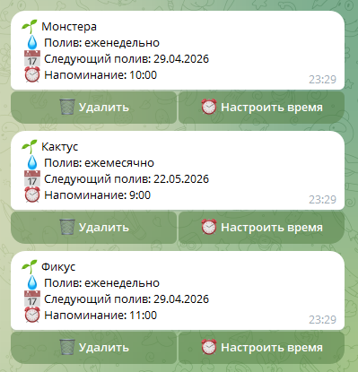
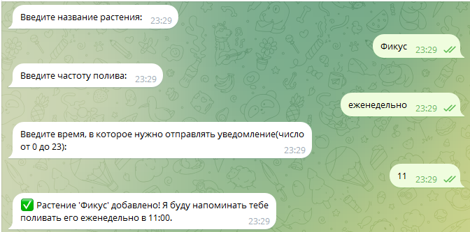

# 🌱 Поливатор - бот для напоминаний о поливе растений

> Телеграм-бот, который помнит о твоих растениях.

    

---

## О проекте

Поливатор - это личный проект, выросший из простой потребности: я постоянно забывал поливать свои растения. Вместо того чтобы ставить напоминания в календаре, я написал бота, который сам присылает напоминания в нужное время.

Проект создавался как портфолио с упором на чистую архитектуру и практику C# без туториалов, с нуля.

---

👉 [Попробовать бота](https://t.me/dimagarnQuest_bot)

## Что умеет бот

- 🌱 **Добавить растение** — название, частота полива, время напоминания
- 📋 **Список растений** — карточки с датой следующего полива
- 🗑️ **Удалить растение** — удаляет растение
- ⏰ **Настроить время** — позволяет выбрать удобный час для напоминаний
- 🕰️ **Часовой пояс** — бот учитывает часовые пояса
- 🔔 **Автоматические напоминания** — бот напоминает полить растения с выбранной регулярностью в указанное время

---

## Скриншоты

### Главное меню


### Список растений



### Создание растения



### Напоминание


---

## Стек технологий

| Технология                | Зачем                             |
| ------------------------- | --------------------------------- |
| **C# / .NET 10**          | Язык и платформа                  |
| **Telegram.Bot 22.x**     | Взаимодействие с Telegram API     |
| **PostgreSQL**            | Хранение растений и пользователей |
| **Entity Framework Core** | ORM для работы с базой данных     |
| **Hangfire**              | Планировщик задач для напоминаний |
| **Ubuntu 24.04**          | Сервер для деплоя                 |
| **GitHub Actions**        | CI/CD автодеплой при каждом пуше  |

---

## Архитектура

```
BotHandler
├── MessageHandler     — обрабатывает текстовые сообщения и кнопки
├── CallbackHandler    — обрабатывает нажатия инлайн-кнопок
└── UserStateManager   — FSM состояния пользователей

Services
├── PlantService       — CRUD растений, Hangfire jobs
└── UserService        — регистрация, часовой пояс

Models
├── Plant              — модель растения
└── User               — модель пользователя с часовым поясом

UserStateManager       — FSM состояния пользователей (ConcurrentDictionary)
```

Бот построен на паттерне **FSM (конечный автомат состояний)** — каждый пользователь имеет своё состояние, которое меняется по ходу диалога. Это позволяет вести многошаговые диалоги (создание растения, настройка времени) без путаницы между пользователями.

---

## Запуск локально

### Требования

- .NET 10 SDK
- PostgreSQL

### Шаги

**1. Клонирование репозитория**

```bash
git clone https://github.com/dimagarn/telegram-portfolio-bot.git
cd telegram-portfolio-bot
```

**2. Создание базы данных в PostgreSQL**

```sql
CREATE USER 'username' WITH PASSWORD 'yourpassword';
CREATE DATABASE plantsdb OWNER 'username';
CREATE DATABASE hangfiredb OWNER 'username';
```

**3. Создание `appsettings.json` в корне проекта**

```json
{
  "BotConfiguration": {
    "token": "ВАШ_ТОКЕН_БОТА"
  },
  "ConnectionStrings": {
    "hangfireConnectionString": "Host=localhost;Database=hangfiredb;Username=username;Password=yourpassword"
  }
}
```

> Токен получить у [@BotFather](https://t.me/BotFather) в Telegram.

**4. Обновление строки подключения в `AppDbContext.cs`**

```csharp
optionsBuilder.UseNpgsql("Host=localhost;Database=plantsdb;Username=username;Password=yourpassword");
```

**5. Запуск**

```bash
dotnet run
```

---

## Деплой на сервер

Проект настроен на автодеплой через **GitHub Actions** — при каждом пуше в `master` сервер автоматически получает обновления и перезапускает бота.

Бот работает как **systemd сервис** на Ubuntu 24.04, запускается при старте системы и автоматически перезапускается при падении.

---

## Чему я научился в этом проекте

- Работать с Telegram Bot API (ReplyKeyboard, InlineKeyboard, CallbackQuery)
- Использовать паттерн FSM для управления состоянием пользователей
- Планировать задачи через Hangfire с Cron-выражениями
- Entity Framework Core, миграции, Change Tracking
- Async/await и многопоточность в .NET
- Производить деплой на Linux сервер, настройка systemd и CI/CD через GitHub Actions

---

## Контакты

Telegram: [@shelling](https://t.me/shelling)  
GitHub: [dimagarn](https://github.com/dimagarn)
